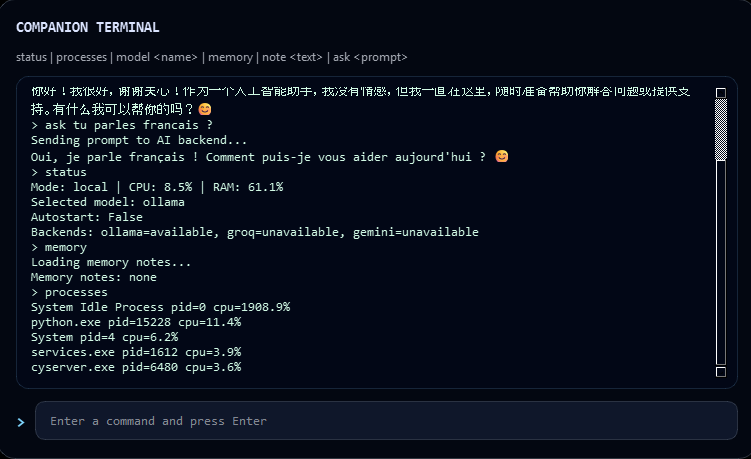

# AI Windows Companion

Persistent Windows AI companion with a frameless pixel-art overlay, keepalive daemon behavior, Telegram alerts, SQLite memory, and pluggable AI backends.



## Status Preview

<table>
  <tr>
    <td align="center"><strong>Idle</strong></td>
    <td align="center"><strong>Thinking</strong></td>
    <td align="center"><strong>Remote</strong></td>
    <td align="center"><strong>Alert</strong></td>
  </tr>
  <tr>
    <td align="center"></td>
    <td align="center"></td>
    <td align="center"></td>
    <td align="center"></td>
  </tr>
</table>

## Current Capabilities
- Windows idle/presence detection and mode switching
- Keepalive jitter using Win32 APIs
- Overlay companion with sprite states, speech bubble, and CLI console
- Telegram bot with status, model, memory, and AI chat commands
- SQLite-backed config and retry queue persistence
- Ollama, Groq, and Gemini client abstraction with fallback orchestration
- Settings window with autostart toggle and backend health

## Requirements
- Windows
- Python 3.11+
- Telegram bot token and chat ID if Telegram is enabled

## Install
```powershell
python -m pip install -r requirements.txt
```

Optional editable install:
```powershell
python -m pip install -e .
```

## Run
Supported launch options during development:
```powershell
python .\main.py
python .\run.py
python -m ai_companion
```

If installed with `pip install -e .`:
```powershell
ai-companion
```

## Configure
Use `config.yaml` for local settings. `config.example.yaml` is the sanitized template for sharing or packaging.

Sensitive values can be provided through environment variables instead of committing them to disk:
- `TELEGRAM_BOT_TOKEN`
- `TELEGRAM_CHAT_ID`
- `GEMINI_API_KEY`
- `GROQ_API_KEY`
- `OLLAMA_URL`

Important fields:
- `telegram.token`
- `telegram.chat_id`
- AI backend keys and URLs
- monitoring thresholds
- UI defaults

Runtime data locations:
- `config.yaml` is read from the runtime directory
- `memory/companion.db` stores persistent app state and queued Telegram messages
- `memory/notes/*.md` stores long-term note files used for AI context
- when packaged, writable runtime files live beside `AIWindowsCompanion.exe`

## Telegram Commands
- `/help`
- `/ping`
- `/status`
- `/processes`
- `/mode`
- `/model [name]`
- `/ask <prompt>`
- `/note <text>`
- `/memory`

If the Telegram bot is enabled and starts successfully, the app registers these commands with Telegram so they appear in the bot command menu as well as working through typed slash commands.

## CLI Commands
- `status`
- `processes`
- `model <name>`
- `memory`
- `note <text>`
- `ask <prompt>`

## Tests
```powershell
python -m unittest
```

## Build Executable
Build the Windows executable with PyInstaller:
```powershell
powershell -ExecutionPolicy Bypass -File .\build.ps1 -Clean
```

Output directory:
```text
dist\AIWindowsCompanion\
```

Main executable:
```text
dist\AIWindowsCompanion\AIWindowsCompanion.exe
```

The build script also stages:
- `config.example.yaml` as `config.yaml`
- `memory\notes\`
- bundled `assets\sprites\`

## Packaging Notes
The executable is currently produced as a PyInstaller one-folder build. Runtime-writable files such as `config.yaml`, `memory\companion.db`, and `memory\notes\` live beside the executable, while bundled UI assets are embedded in the build.
